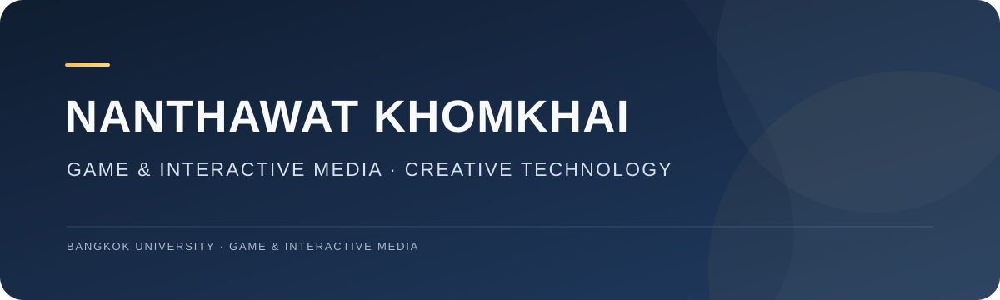

  
   
  
<strong>Game &amp; Interactive Media student · Creative technologist</strong>

  
สวัสดีครับ ผมเต้ สนุกกับการสร้างเกม เว็บ และประสบการณ์ดิจิทัลที่ทำให้คนอยากมีส่วนร่วม

  

    
    
  

---

## 👋 About me

I’m **Nanthawat “Tae” KhomKhai**, a Game &amp; Interactive Media student at Bangkok University. I like turning what I learn into things people can play, explore, or use.

- 🎓 **Tech Talent Scholarship** — 100% scholarship, Bangkok University
- 🌐 **Google Student Ambassador** — Batch 2
- 🤝 **Vice President**, BU ITI Student Committee
- 🎮 Interested in game development, interactive experiences, and creative technology
- 🎥 I also enjoy visual storytelling, photography, and video editing

## 🧰 Tools I explore

`TypeScript` · `React` · `Three.js` · `Unreal Engine` · `HTML` · `CSS` · `JavaScript`

## 🚀 Featured work

| Project | What it is | Link |
| --- | --- | --- |
| **The IT Support Hero** | An interactive game about solving IT support challenges | [GitHub](https://github.com/nanthawatkhom-creator/Game-The-IT-Support-Hero.github.io) |
| **CaseLink G5** | A web concept for helping make case information easier to explore | [GitHub](https://github.com/nanthawatkhom-creator/CaselinkG5.github.io) |
| **Little Dreamland** | A game made with a team for BU × VIVERSE Game Jam | [Portfolio](https://nanthawatkhom-creator.github.io/#work) |
| **Portfolio 2026** | My journey, projects, and experiences | [Visit site](https://nanthawatkhom-creator.github.io/) |

## 🎯 What I’m working toward

Building stronger skills in game development and web technologies, sharing what I learn, and making digital experiences that feel fun and useful.

## 📫 Find me

- Portfolio: [nanthawatkhom-creator.github.io](https://nanthawatkhom-creator.github.io/)
- Email: [nanthawat.khom@gmail.com](mailto:nanthawatkhom@gmail.com)
